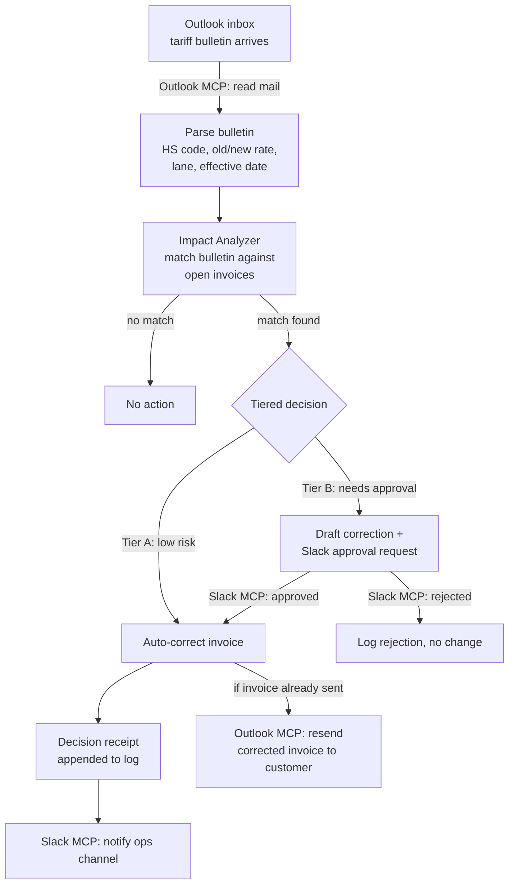

# Tariff Watch — a tiered-autonomy agent for landing tariffs

**Challenge:** DTU × DSV — *Trusted Autonomy in Global Supply Chains*
**This exercise:** one narrow slice of the vision — keeping a single document type (the
commercial invoice) correct the moment a tariff changes, with the right amount of
human oversight and a full audit trail.

## 1. The problem

When a tariff rate changes, every open shipment on the affected lane/HS code has a
stale duty figure sitting in its commercial invoice. If nobody catches it before the
invoice goes to customs or the customer, that mismatch causes exactly the kind of
delay the challenge brief describes — held shipments, disputed invoices, re-work.
Someone has to notice the change, work out which invoices are affected, fix them, and
tell the right people — fast, and in a way that can be checked afterwards.

## 2. Scope for this exercise

Deliberately narrow, to keep the architecture simple:

- **One trigger channel:** an Outlook inbox that receives tariff bulletins.
- **One document type:** the commercial invoice (not customs declarations, quotes, or
  price lists — those are natural next steps, see §7).
- **One agent**, not a multi-agent system.
- **Two notification channels:** Slack (internal ops team) and Outlook (customer).

## 3. Architecture



## 4. Components

| Component | Responsibility |
|---|---|
| **Inbox watcher** | Polls/reads a designated Outlook mailbox for new mail matching tariff-bulletin patterns (sender, subject keywords). |
| **Bulletin parser** | Extracts structured data from the email: HS code(s), old rate, new rate, effective date, lane/country. |
| **Impact analyzer** | Looks up open invoices whose HS code + lane match the bulletin; computes the corrected duty amount for each. |
| **Tiered decision engine** | Applies the agency rules in §5 to decide whether to act alone or ask a human first. |
| **Corrector** | Writes the new duty figure into the invoice record. |
| **Decision log** | Appends a structured receipt for every action taken (auto or approved), per §6. |
| **Notifier** | Posts to Slack (internal) and/or sends via Outlook (customer-facing) depending on the tier and invoice status. |

## 5. Tiered agency rules

This is the direct implementation of the challenge's "Agency" success path — authority
widens only as confidence is justified.

| Tier | Criteria | Action |
|---|---|---|
| **A — act alone** | Invoice not yet sent to the customer **and** invoice value below threshold (e.g. €10,000) **and** exactly one tariff rule applies | Agent corrects the invoice immediately, logs the receipt, and posts an FYI to Slack. |
| **B — act with approval** | Invoice already sent to the customer, **or** value above threshold, **or** more than one tariff rule could apply | Agent drafts the correction and posts it to Slack as an approval request; only proceeds once a human approves. A rejection is logged too, with no change made. |

The threshold and criteria are config, not code — tightening or loosening them is how
"authority widens as confidence is proven" would work over time.

## 6. Transparency: the decision receipt

Every action (or non-action after a Tier B rejection) produces one receipt so it can be
replayed and challenged later, per the challenge's "Transparency" success path.

```json
{
  "receipt_id": "DR-2026-0001",
  "timestamp": "2026-09-10T08:14:32Z",
  "trigger_email_id": "email-001",
  "tariff_rule": {
    "hs_code": "8501.10",
    "lane": "COUNTRY_X->EU",
    "old_rate_pct": 4.5,
    "new_rate_pct": 7.8,
    "effective_date": "2026-09-15"
  },
  "invoice_id": "INV-2031",
  "field_changed": "duty_amount_eur",
  "old_value": 189.00,
  "new_value": 327.60,
  "tier": "A",
  "approver": null,
  "rationale": "Invoice open, value below threshold, single applicable rule."
}
```

## 7. Skills

- **`skills/tariff-impact-analysis/SKILL.md`** — packages the parsing and matching
  logic (bulletin → structured tariff rule → affected invoices → corrected figures) as
  a reusable skill the agent invokes whenever a tariff-shaped email shows up. Keeping
  it as a skill (rather than baking it into the agent loop) means the same logic could
  later be reused for customs declarations or price lists without rewriting the agent.

## 8. MCP servers

- **Outlook MCP** — trigger (reading the tariff-bulletin inbox) and one action
  (resending a corrected invoice to a customer whose original invoice already went
  out).
- **Slack MCP** — the human-in-the-loop channel: approval requests for Tier B, and
  FYI notifications for Tier A, both to an ops/customs channel.

In this exercise both are **stubbed** (`demo/integrations/outlook_mcp.py` and
`slack_mcp.py`) — plain Python functions that print what they would send — because no
live Slack/Outlook connection was authorized in this environment. Swapping them for
real MCP tool calls is a drop-in change; nothing else in the demo depends on the stub.

## 9. Out of scope here (next steps for the fuller vision)

- **Resilience:** re-routing a shipment mid-journey when a tariff makes a lane
  uneconomical — this exercise only corrects a document, it doesn't re-plan.
- **Sustainability:** carbon as a live decision variable — not touched by tariff
  handling.
- **More document types:** customs declarations and customer quotes/price lists follow
  the same pattern as the invoice corrector.
- **Real bulletin parsing:** the demo's parser is a simple structured stand-in; a real
  version would need to handle free-text bulletins from many customs authorities.

## 10. Running the demo

```
python3 demo/run_demo.py
```

Simulates one tariff bulletin landing in the inbox, matches it against three mock
invoices (one clean Tier A case, one Tier B case needing approval, one unaffected
invoice), and prints the full flow — including the Slack/Outlook stub calls and the
resulting decision log (`demo/decision_log.jsonl`).
